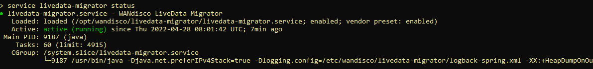
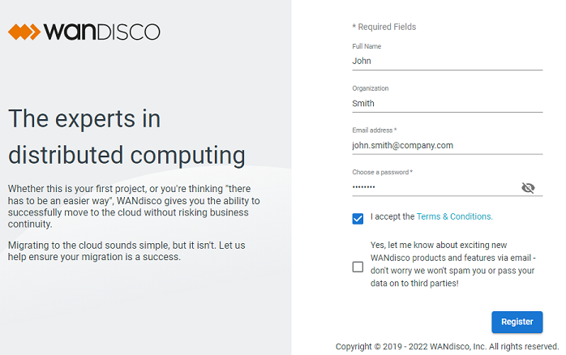
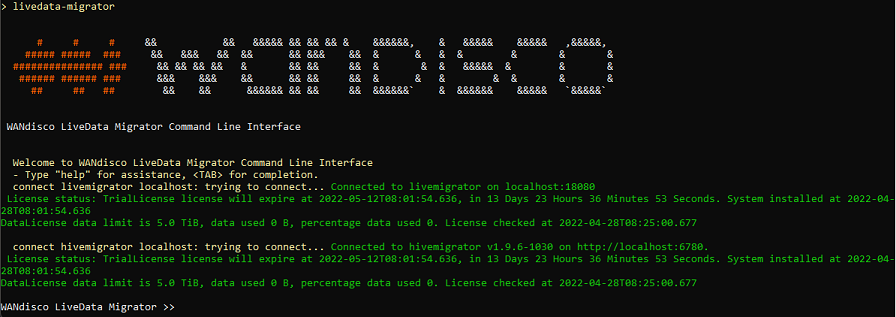

# Install and Get Started

## Introduction

This lab walks you through the steps to install and start using LiveData Migrator. Follow the tasks to get ready to use LiveData Migrator.

Estimated Time: 30 minutes

### About LiveData Migrator

WANdisco LiveData Migrator accelerates data estate modernization on Oracle Data Lakehouse by automating large-scale movement of data and metadata from existing on-premises data lakes to OCI. It also enables near real-time replication of ongoing changes made to the data sets being migrated.

### Objectives

In this lab, you will:
* Learn about host server prerequisites
* Configure network access
* Install LiveData Migrator
* Get started with the UI and CLI

### Prerequisites

This lab assumes you have:
* Hadoop data lake
    - See the [release notes](https://community.wandisco.com/s/article/Release-Notes-WANdisco-LiveData-Migrator-Release-Notes-1-18) for a list of supported Hadoop distributions
* Linux host
    - See the [release notes](https://community.wandisco.com/s/article/Release-Notes-WANdisco-LiveData-Migrator-Release-Notes-1-18) for a list of supported operating systems
* Java 1.8 64-bit
* Hadoop client libraries installed on the Linux host
    - The necessary Hadoop client libraries will be present, if your Linux host is configured as a Hadoop edge node with HDFS Gateway role
* Ability to authenticate as the user hdfs or other HDFS superuser
    - The necessary access will be in place, if your Linux host is configured as a Hadoop edge node with HDFS Gateway role
    - If Kerberos is enabled in your Hadoop environment, a valid keytab containing a suitable principal must be available on the Linux host
* Network connectivity as detailed in the next section


## Configure Network Access

There are two LiveData Migrator components that use ports for TCP connections: LiveData Migrator and LiveData Migrator UI. Configure your network to allow the LiveData Migrator host to connect to your migration source environment and to your migration target environment.

1. Open the following LiveData Migrator ports

   | Port | Description | Direction |
   | --- | --- | --- |
   | 18080 | LiveData Migrator REST API | Inbound  |
   | 443 | LiveData Migrator data transfer | Outbound |

Configure your network to allow access to the UI running on the LiveData Migrator host.

2. Open the following UI port

   | Port | Description | Direction |
   | --- | --- | --- |
   | 8081 | LiveData Migrator UI | Inbound  |

## Install LiveData Migrator

1. [Download LiveData Migrator](https://www2.wandisco.com/ldm-trial) to your host

2. Make the installation script executable and install as the root user or as a sudo user.

    ```
    <copy>chmod +x ./livedata-migrator.sh && ./livedata-migrator.sh</copy>
    ```

3. Check the status of the services using these commands

	 ```
	 <copy>service livedata-migrator status</copy>
	 ```
	 ```
	 <copy>service livedata-ui status</copy>
	 ```

   

## Get Started

Both the LiveData Migrator User Interface (UI) and the Command Line Interface (CLI) can be used to configure and operate data migrations.

1. Access the UI for the first time

The UI is available on port 8081 on your LiveData Migrator host. For example, if you were running LiveData Migrator on a host named myldmhost.example.com, the URL to load in your browser would be:

```
<copy>http://myldmhost.example.com:8081</copy>
```

You'll be asked to register the first time you use the UI. Fill in the registration form to create your user account.

   

2. Start the CLI

Registration is not necessary to start using the CLI. Run the following command from the command prompt of your Linux host.

```
<copy>livedata-migrator</copy>
```

   

## Learn More

* [LiveData Migrator User Guide: Installation](https://docs.wandisco.com/live-data-migrator/docs/prereqs)

## Acknowledgements
* **Author** - Diliana Miteva, Sr. Solutions Architect, WANdisco EMEA
* **Last Updated By/Date** - Diliana Miteva, April 2022
