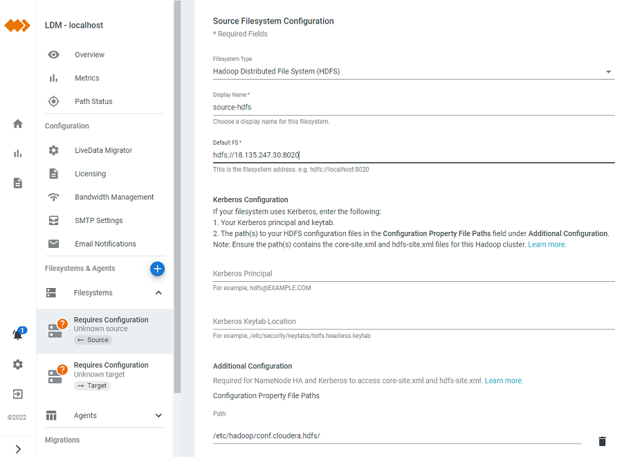
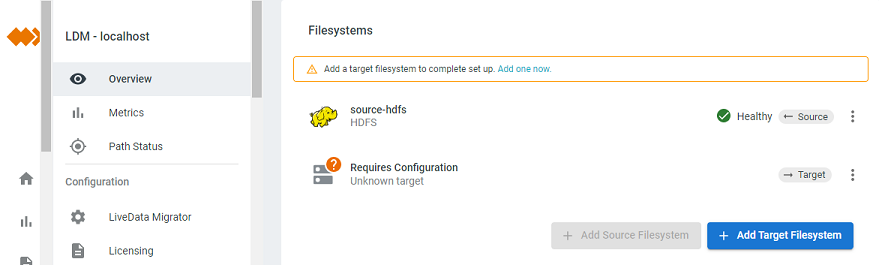
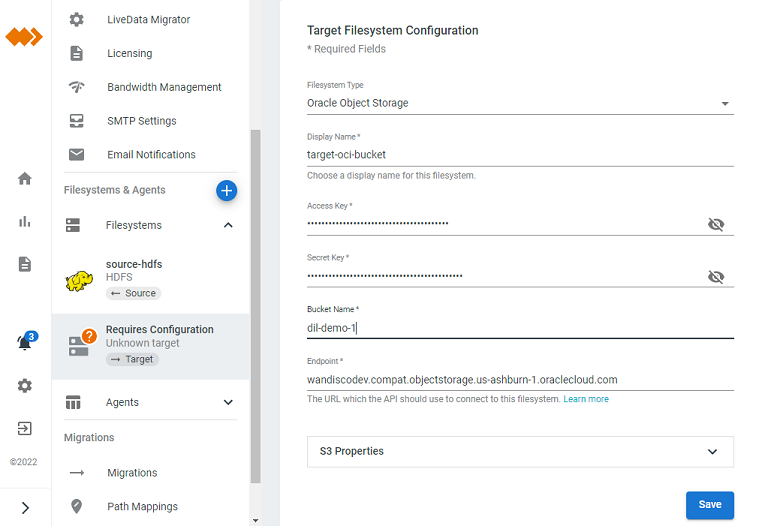
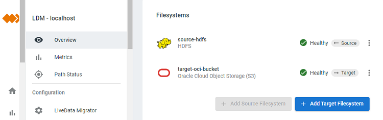
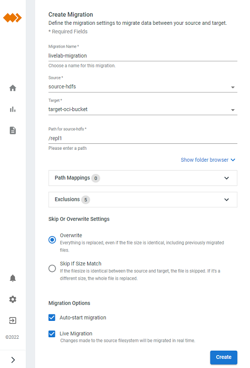
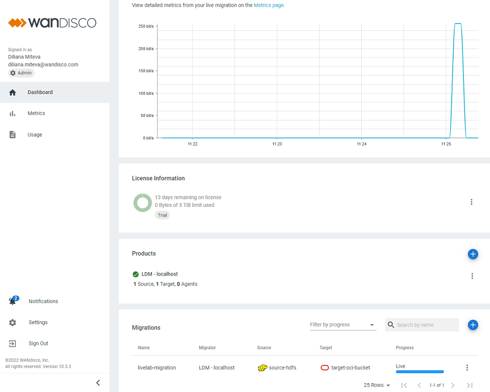

# Migrate Hadoop Data to OCI Object Storage

## Introduction

This lab walks you through the steps to configure and run migrations from Hadoop Distributed File System (HDFS) to OCI object storage.

Estimated Lab Time: 40 minutes

### About LiveData Migrator
WANdisco LiveData Migrator accelerates data estate modernization on Oracle Data Lakehouse by automating large-scale movement of data and metadata from existing on-premises data lakes to OCI. It also enables near real-time replication of ongoing changes made to the data sets being migrated.

### Objectives

In this lab, you will:
* Configure source file system HDFS
* Configure target file system OCI Object Storage
* Configure and run a migration
* Run a migration

	    > You will accomplish these objectives using the LiveData Migrator UI.

### Prerequisites

This lab assumes:
* You've successfully completed the Install and Get Started lab
* You have an OCI object storage bucket
    - Object storage access and secret keys
    - Object storage endpoint URL reachable from the LiveData Migrator host

## Configure HDFS source

    > When LiveData Migrator is installed on an edge node of Hadoop, in most cases the installation process automatically detects HDFS source file system. The automatically detected source file system will be visible in the UI. In this case you can skip this task and move to the next.

1. Add source file system

Once you log in to LiveData Migrator UI click on LDM in the Products panel to open configuration options. Navigate to the File Systems area, click on Add Source and provide the following details:
* File System Type
    - Select Hadoop Distributed File System (HDFS)
* Display Name
    - Enter a display name for your source file system
* HDFS default FS endpoint
    - This is the fs.defaultFS property value as in your HDFS configuration
* Modify the default path to HDFS configuration files (Optional)
    - Enter the directory or directories on your LiveData Migrator host where core-site.xml and hdfs-site.xml are located

  

Click Save to add the specified source file system.

2. Validate your source file system

You will see the green status Healthy "LiveData Migrator connected successfully to your file system". Take into account that it takes some time for the connection to be established. You can move to the next task and validate the status of the source file system later.

  

## Configure OCI target

1. Add target file system

Navigate to the File Systems area, click on Add Target and provide the following details:
* File System Type
    - Select Oracle Object Storage
* Display Name
    - Enter a display name for your target file system
* Access Key
    - Object storage access key
* Secret key
    - Object storage secret key
* Bucket Name
    - Object storage bucket name
* Endpoint
    - Object storage endpoint URL

  

Click Save to add the specified target file system.

2. Validate your target file system

You will see the green status Healthy "LiveData Migrator connected successfully to your file system". Take into account that it takes some time for the connection to be established.  You can move to the next task and validate the status of the target file system later.

  

## Configure and run a migration

1. Create a data migration

Navigate to the Migrations panel, click on the plus button and provide the following details:

* Migration Name
    - Enter a name for the migration
* Source
    - Select the HDFS source file system added in the first task of this lab
* Target
    - Select the OCI Object Storage file system added in the second task of this lab
* Path
    - Path to a directory on your source file system to be migrated to the target

Select the Auto-start migration option and leave the default settings for the rest of the configuration options.

  

Click Create to create and start the specified migration.

2. Validate your migration
The current status of your newly created migration will be visible in the Migrations panel. After some initial file scan at the source you will notice data transfer activity. You can then move to the OCI interface and validate that the data located in the specified path has been successfully migrated.

  

## Learn More

* [LiveData Migrator User Guide: Migrate Data](https://docs.wandisco.com/live-data-migrator/docs/configure-storage)

## Acknowledgements
* **Author** - Diliana Miteva, Sr. Solutions Architect, WANdisco EMEA
* **Last Updated By/Date** - Diliana Miteva, April 2022
