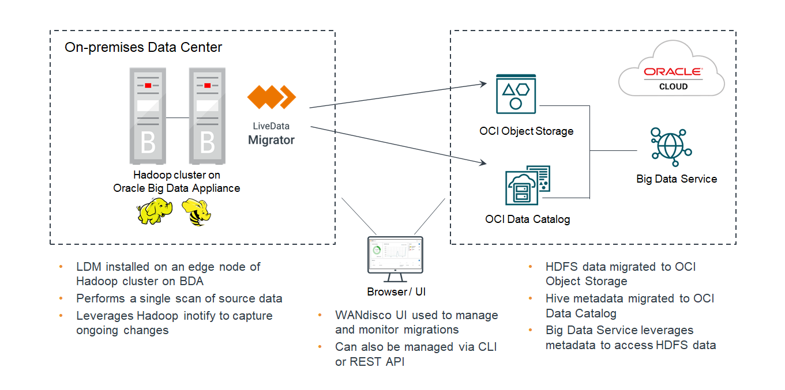

# Overview

## Introduction

This lab walks you through the core capabilities of LiveData Migrator.

Estimated Time: 10 minutes

### Context

A data lakehouse combines the cost and scale advantages of the data lake with the analytics capabilities of data warehouse technologies. It enables you to ingest, store, analyze, and derive business value from large constantly changing data sets. Oracle Cloud Infrastructure (OCI) provides the foundation for the lakehouse as an open and flexible approach to analyzing any type of data, at any scale, from anywhere. However, migrating data lakes into OCI can be challenging without the right support.

Oracle has partnered with WANdisco to make the unique benefits of WANdisco LiveData Migrator available to OCI users. This migration solution enables organizations to move away from costly high maintenance traditional platforms, such as Hadoop data lakes, without disrupting the operation of those platforms during migration. It helps you to migrate data and metadata to Oracle Cloud quickly and easily so that you can exploit the power and capabilities of OCI and its services, including Oracle Cloud Object Storage, Oracle Big Data Service and Oracle Lakehouse.

### Objectives

In this lab, you will:
* Understand the LiveData Migrator high-level architecture
* Learn about the LiveData Migrator core capabilities
* Learn about use cases supported by LiveData Migrator

## High-Level Architecture

WANdisco LiveData Migrator is capable of highly performant transfer of files while they are under active change. It performs a single scan of files and objects at the migration source and caters for files and objects that are actively changing. This provides a significant time saving over other Hadoop migration products that are commonly based on iterative file scans. Hadoop Compatible File System (HDFS) is typically used as a data source, but other sources are also supported. Targets include HDFS on-premise or in cloud as well as different types of object storage.

## Core Capabilities

WANdisco's technology automates the migration of changing data sets at scale and is designed and proven to scale to multipetabyte data lake migrations. OCI adopters have the following key advantages available through LiveData Migrator:
* Live data migration allows you to migrate actively changing data without scheduling repeated scans of the source datasets. Migration begins and completes without any change to the source and without needing to restrict data movement to periods of downtime or reduced usage at the source.
* Selective data migration ensures that you don’t incur the overhead of moving unneeded data. You can bypass temporary files, staging locations, intermediate representations, and more to ensure that only data delivered to your lakehouse is what you want available.
* Selective metadata migration makes the information describing your data available to OCI Data Catalog, so that you can immediately access and process structured or semi-structured data with ease.
* Data consistency provides comprehensive facilities to ensure that data arrives in your lakehouse in the same form as it is present in your sources. LiveData Migrator provides confidence that your the outcomes from OCI analytics are wholly accurate and comprehensive.
* Broad compatibility allows you to migrate a wide range of different source data lakes, whether they are on-premises, in different regions of Oracle Cloud, in other clouds, or built on Hadoop or Spark based platforms.

## Use Cases
The use cases around data lake migration usually fall into the following scenarios:
* Cloud Data Migration
* Hybrid Data Estate
* Cloud Burst
* Cloud Analytics
* Disaster Recovery
* Backup

## Learn More

* [WANdisco Oracle partner page](https://wandisco.com/partners/oracle)

## Acknowledgements
* **Author** - Diliana Miteva, Sr. Solutions Architect, WANdisco EMEA
* **Last Updated By/Date** - Diliana Miteva, April 2022
